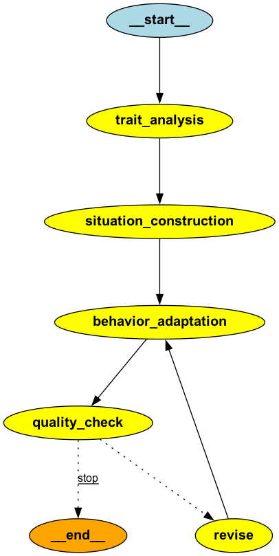
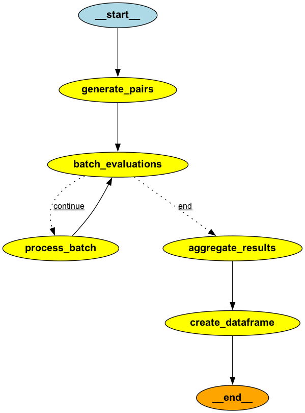

# SJTAgent

基于LLM的情境判断测验(SJT)自动生成系统，用于生成个性化的人格评估题目。

## 项目简介

SJTAgent是一个使用大语言模型(LLM)自动生成个人情境判断测验(Personal Situation Judgment Test, PSJT)的智能系统。该项目通过多阶段工作流程，将传统的自评量表题目转换为更加真实有效的情境化评估题目。

### 核心特性

- **多阶段工作流**: 包括特质分析、情境构建、行为适应、质量控制等步骤
- **自动化生成**: 基于Big Five人格特质理论，自动生成高质量的情境判断题目
- **质量评估**: 内置评估模块，确保生成题目的有效性和一致性
- **多语言支持**: 支持中文和英文题目生成


## 项目结构

```
SJTAgent/
├── sjtagent_v0.1.py         # 主程序入口
├── src/
│   ├── workflow/            # 核心工作流程模块
│   │   ├── main.py         # 主要生成函数
│   │   ├── graph_builder.py # 工作流图构建
│   │   ├── trait_analysis.py # 特质分析
│   │   ├── situation_construction.py # 情境构建
│   │   ├── behavior_adaptation.py # 行为适应
│   │   └── quality_control.py # 质量控制
│   └── eval/               # 评估模块
│       ├── aig_eval.py     # AIG评估
│       └── item_eval.py    # 题目评估
├── datasets/               # 数据集
│   ├── SJTs/              # SJT测验数据
│   └── aig_prompts/       # AIG提示模板
├── results/               # 生成结果
└── docs/                  # 文档和图片
```

## 快速开始

1. 安装依赖：
```bash
pip install -r requirements.txt
```

2. 当前v0.1 工作流版本：
sjtagent_v0.1.py


3. 生成题目质量评估：
python eval_aigs.py

## TODO

### sjtagent_v0.1 待完成任务
- [ ] 优化生成算法，使其能够产生符合eval模块评估标准的高质量测验题目
- [ ] 完善质量控制机制，提高题目的心理测量学指标
- [ ] 增强评估模块的准确性和全面性

### sjtagent_v0.2 计划功能
- [ ] **ReAct功能**: 实现推理-行动(Reasoning-Acting)循环，提升生成过程的自适应能力
- [ ] **GroupDiscuss功能**: 引入多智能体讨论机制，通过群体协作提升题目质量
- [ ] **高级工作流**: 支持更复杂的生成策略和优化算法
- [ ] **批量生成**: 支持大规模题目批量生成和管理
- [ ] **自定义特质**: 支持用户定义的个性特质和评估维度


## 贡献

欢迎小伙伴们提交Issue和Pull Request来推进项目。

### v0.1工作流



### 评估方法

